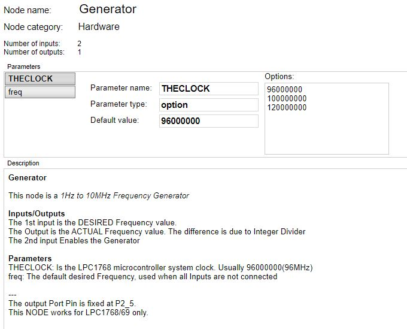

 # nBlocksStudio Generator 
 ## NODE

This node is a 1Hz to 10MHz Frequency Generator
The input is the DESIRED Frequency value.
The Output is the ACTUAL Frequency value. The difference is due to Integer Divider
The CLOCK parameter is the LPC176x Clock frequency, which is usually 96MHz

----
The output Port Pin is fixed at P2_5.
LPC1768/69 only.

---

 Author: Nikos Chalikias 